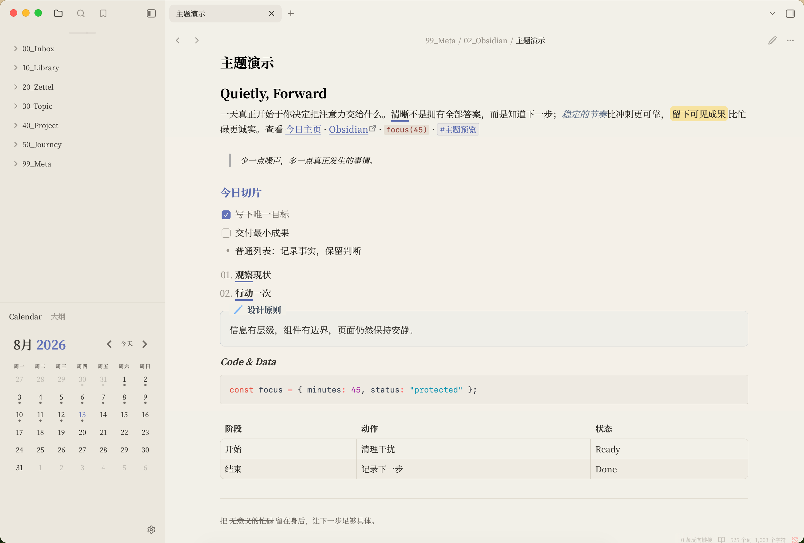

# Obsidian Kit

一套温暖、安静、适合长期阅读与写作的个人 Obsidian 配置。



这个仓库集中保存两类内容：当前使用的 **Baseline 主题与个人 CSS**，以及自己开发的 **Secret Copy 插件**。它只包含可公开、可重建的配置，不包含 vault 笔记、工作区状态或真实密钥。

## Appearance

当前外观由三层组成：

- **Baseline `3.2.12`**：基础主题快照。
- **`zymir-obsidian-theme.css`**：字体、暖色纸张背景、内容版心、编辑/阅读节奏与常用 Markdown 组件。
- **`red-graphite-codeblocks.css`**：独立的代码块配色与排版。

它不是一个重新发布的独立社区主题，而是一套建立在 Baseline 之上的个人视觉配置。安装方法见 [`appearance/README.md`](./appearance/README.md)。

## Secret Copy

Secret Copy 让笔记只保存密钥引用，在阅读模式中显示标签或掩码：

````markdown
```secret
$DB_PASSWORD|数据库密码
$API_TOKEN
```
````

只有点击“复制”时，插件才会通过本地命令从 macOS 钥匙串、环境变量或密码管理器读取真实值，并直接写入剪贴板。密钥不会进入 Markdown、DOM 或 Git。

源码、构建与安装说明见 [`plugins/secret-copy/README.md`](./plugins/secret-copy/README.md)。

## Structure

```text
.
├── appearance/
│   ├── themes/Baseline/
│   └── snippets/
└── plugins/
    └── secret-copy/
```

## License

个人代码与 CSS 使用 [MIT License](./LICENSE)。Baseline 来自 [aaaaalexis/obsidian-baseline](https://github.com/aaaaalexis/obsidian-baseline)，其快照保留原始版权与 MIT 许可。
